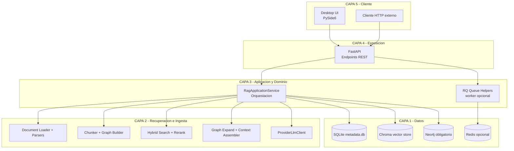
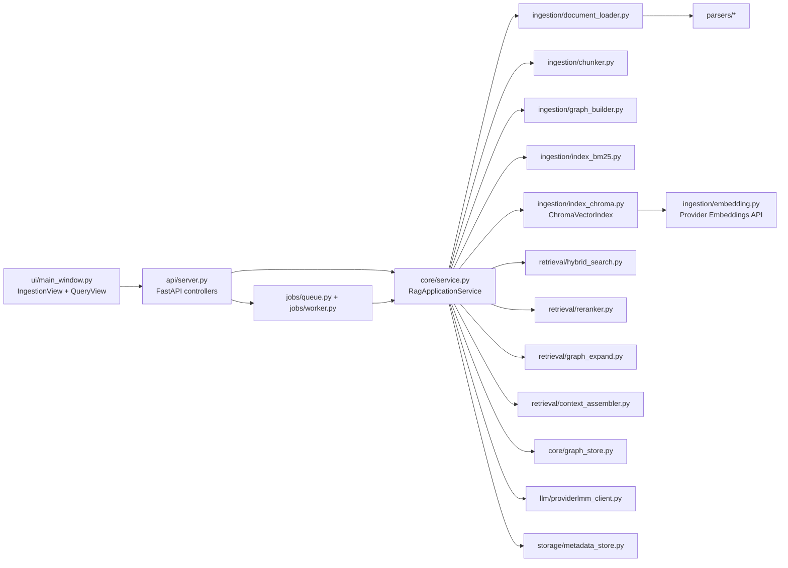
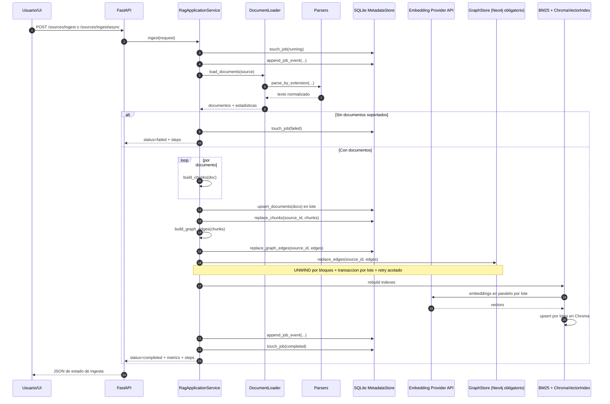
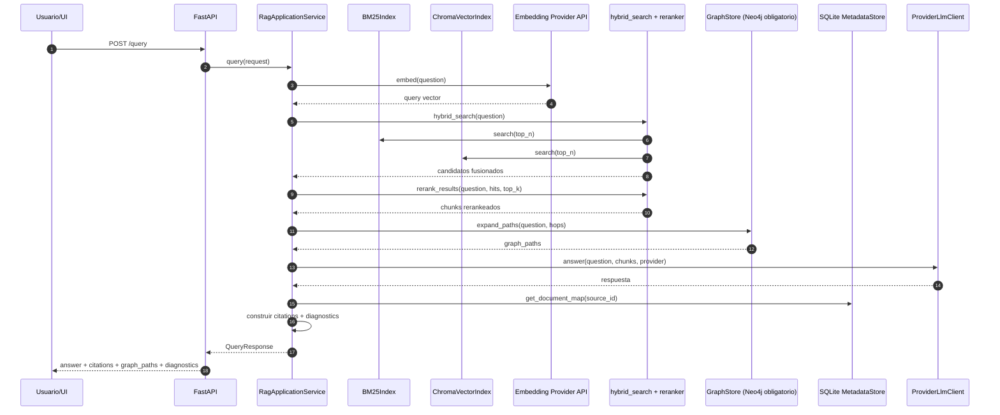

# Arquitectura Tecnica

## Resena de arquitectura

RAG Hybrid Response Validator implementa una arquitectura modular orientada a
servicios para resolver dos capacidades principales:

- Ingesta de conocimiento documental (carpeta local o Confluence) hacia
  estructuras consultables.
- Consulta con RAG hibrido (vector + BM25 + grafo) con trazabilidad de
  evidencia.

El sistema esta disenado para operar con ChromaDB activo en runtime para la
capa vectorial y Neo4j obligatorio para capa de grafo. Componentes opcionales
adicionales de produccion:

- Redis + RQ para ingesta asincrona.
- Proveedores de embedding/answer externos (OpenAI, Gemini, Vertex AI).

## Descripcion general

### Runtime principal

- UI de escritorio en PySide6 (`coderag/ui/*`) para operar ingesta y consulta.
- API FastAPI (`coderag/api/server.py`) como fachada de operaciones.
- Orquestador de negocio (`coderag/core/service.py`) con flujo end-to-end.
- Persistencia SQLite (`coderag/storage/metadata_store.py`) para documentos,
  chunks, aristas, jobs y eventos de timeline por job (`job_events`).
- Persistencia vectorial en Chroma (`coderag/ingestion/index_chroma.py`) para
  embeddings de chunks y busqueda de similitud.
- Retrieval hibrido (`coderag/retrieval/*`) con ranking y expansion por grafo.
- Integracion de LLM (`coderag/llm/providerlmm_client.py`) para respuesta.

### Principios de diseno actuales

- Chroma-first: la capa vectorial requiere Chroma (`USE_CHROMA=true`).
- Neo4j obligatorio: la capa de grafo requiere `USE_NEO4J=true` y credenciales.
- Evolutivo: interfaces internas permiten reemplazar componentes por equivalentes
  gestionados sin romper contratos API/UI.
- Explicable: cada respuesta expone evidencias (`citations`) y rutas de grafo
  (`graph_paths`) con diagnosticos de pipeline.
- Observable: la ingesta persiste eventos con progreso y tiempos acumulados,
  reutilizados por UI/API para seguimiento en vivo.
- Performante por lotes: documentos, Chroma y Neo4j se procesan con estrategias
  de batching para reducir latencia total en ingestas medianas/grandes.

## Diagrama de infraestructura por capas

### Notas de capas

- Capa 5 (Cliente): UI de operacion y clientes de integracion via HTTP.
- Capa 4 (Exposicion): contratos estables de API (`/sources/*`, `/query*`).
- Capa 3 (Aplicacion y Dominio): coordina casos de uso y politicas del flujo.
- Capa 2 (Recuperacion e Ingesta): contiene logica de parseo, chunking,
  indexacion, retrieval y grounding para respuesta.
- Capa 1 (Datos): almacenamiento local obligatorio y servicios externos
  opcionales para escalar capacidades.

## Diagrama de componentes

## Secuencia principal: ingesta

## Secuencia principal: consulta

## Consideraciones de despliegue

- Modo local (default): API + UI + SQLite + Chroma persistente.
- Modo expandido: activar `USE_RQ=true` para procesamiento asincrono.
- Docker Compose incluye servicios `redis` y `neo4j`; la capa vectorial usa
  Chroma embebido en disco dentro de la API (`CHROMA_PERSIST_DIR`).

## Optimizaciones recientes de ingesta

- Persistencia de documentos en SQLite en lote (`upsert_documents`) para
  reducir commits por documento.
- Persistencia de relaciones en Neo4j con UNWIND por bloques configurables,
  transaccion por lote y reintentos acotados para fallas transitorias.
- Generacion de embeddings de chunks con concurrencia configurable y escritura
  a Chroma por lotes para mejorar throughput.
- Timeline de ingesta persistido en `job_events` con progreso (`progress_pct`)
  y `elapsed_ms` acumulado para visualizacion en UI y polling de jobs.

Parametros de tuning relevantes:

- `INGEST_EMBED_WORKERS`
- `CHROMA_UPSERT_BATCH_SIZE`
- `NEO4J_INGEST_BATCH_SIZE`
- `NEO4J_INGEST_MAX_RETRIES`
- `NEO4J_INGEST_RETRY_DELAY_MS`
