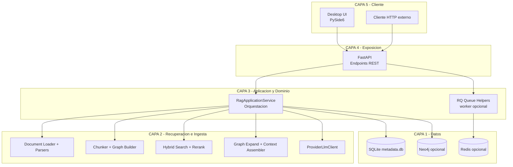
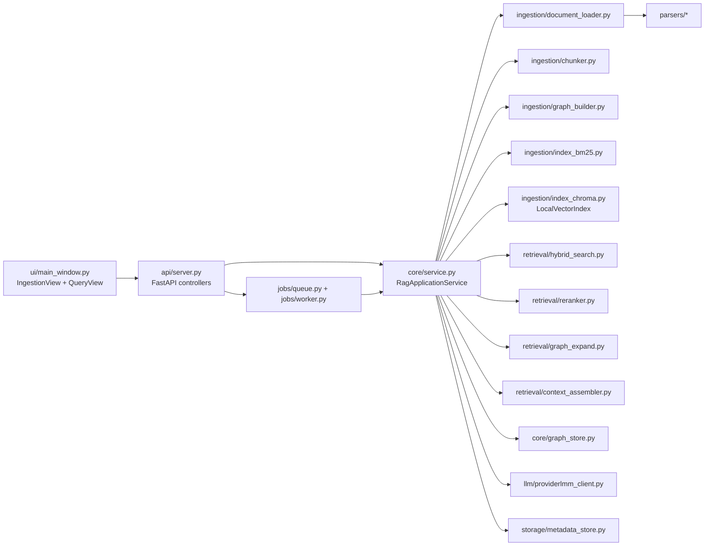
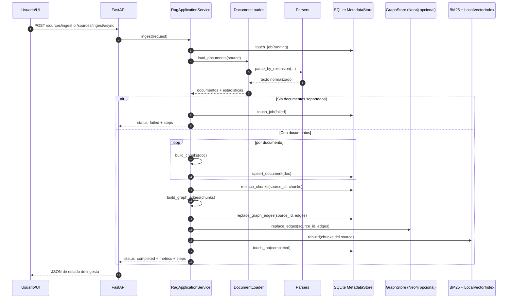
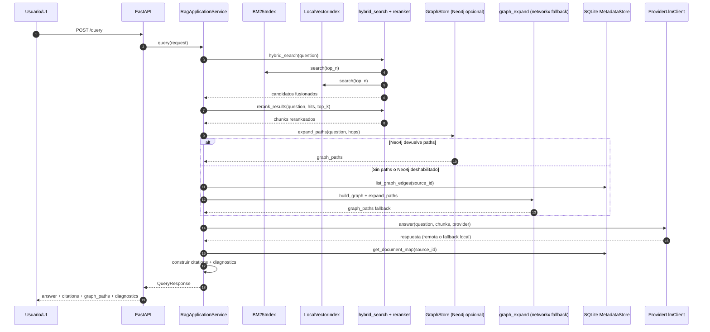

# Arquitectura Tecnica

## Resena de arquitectura

RAG Hybrid Response Validator implementa una arquitectura modular orientada a
servicios para resolver dos capacidades principales:

- Ingesta de conocimiento documental (carpeta local o Confluence) hacia
  estructuras consultables.
- Consulta con RAG hibrido (vector + BM25 + grafo) con trazabilidad de
  evidencia.

El sistema esta disenado para funcionar en modo local por defecto (sin
infraestructura externa obligatoria) y habilitar componentes opcionales en
produccion:

- Redis + RQ para ingesta asincrona.
- Neo4j para expansion de paths multi-hop.
- Proveedores LLM externos (OpenAI, Gemini, Vertex AI).

## Descripcion general

### Runtime principal

- UI de escritorio en PySide6 (`coderag/ui/*`) para operar ingesta y consulta.
- API FastAPI (`coderag/api/server.py`) como fachada de operaciones.
- Orquestador de negocio (`coderag/core/service.py`) con flujo end-to-end.
- Persistencia SQLite (`coderag/storage/metadata_store.py`) para documentos,
  chunks, aristas y jobs.
- Retrieval hibrido (`coderag/retrieval/*`) con ranking y expansion por grafo.
- Integracion de LLM (`coderag/llm/providerlmm_client.py`) con fallback local
  extractivo para ejecucion offline.

### Principios de diseno actuales

- Local-first: el MVP funciona sin depender de servicios externos.
- Evolutivo: interfaces internas permiten reemplazar componentes por equivalentes
  gestionados sin romper contratos API/UI.
- Explicable: cada respuesta expone evidencias (`citations`) y rutas de grafo
  (`graph_paths`) con diagnosticos de pipeline.

## Diagrama de infraestructura por capas

### Notas de capas

- Capa 5 (Cliente): UI de operacion y clientes de integracion via HTTP.
- Capa 4 (Exposicion): contratos estables de API (`/sources/*`, `/query*`).
- Capa 3 (Aplicacion y Dominio): coordina casos de uso y politicas del flujo.
- Capa 2 (Recuperacion e Ingesta): contiene logica de parseo, chunking,
  indexacion, retrieval y grounding para respuesta.
- Capa 1 (Datos): almacenamiento local obligatorio y servicios externos
  opcionales para escalar capacidades.

## Diagrama de componentes

## Secuencia principal: ingesta

## Secuencia principal: consulta

## Consideraciones de despliegue

- Modo local (default): API + UI + SQLite, sin Redis ni Neo4j.
- Modo expandido: activar `USE_RQ=true` y `USE_NEO4J=true` para procesamiento
  asincrono y expansion de grafo remota.
- Docker Compose incluye servicios `redis`, `neo4j` y `chroma`; actualmente el
  runtime usa `LocalVectorIndex` y deja Chroma como capacidad evolutiva.
