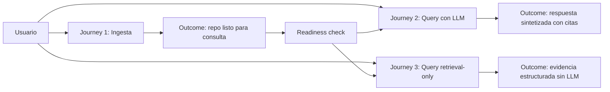
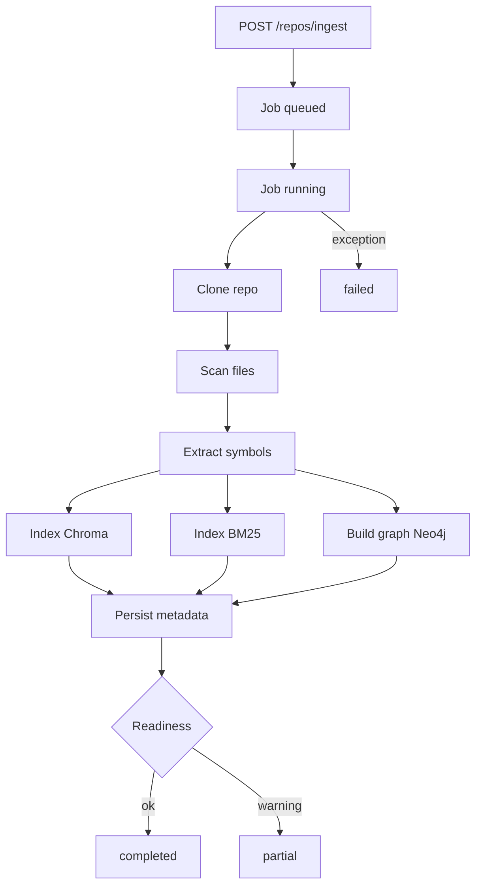
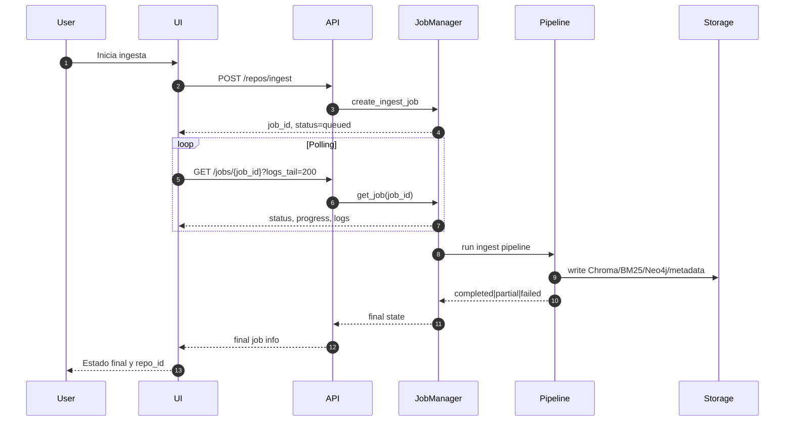
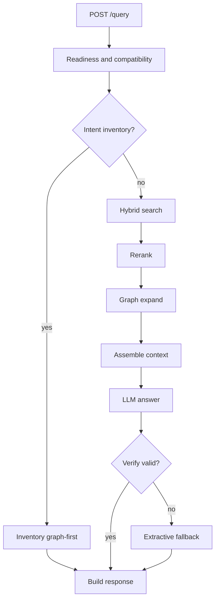
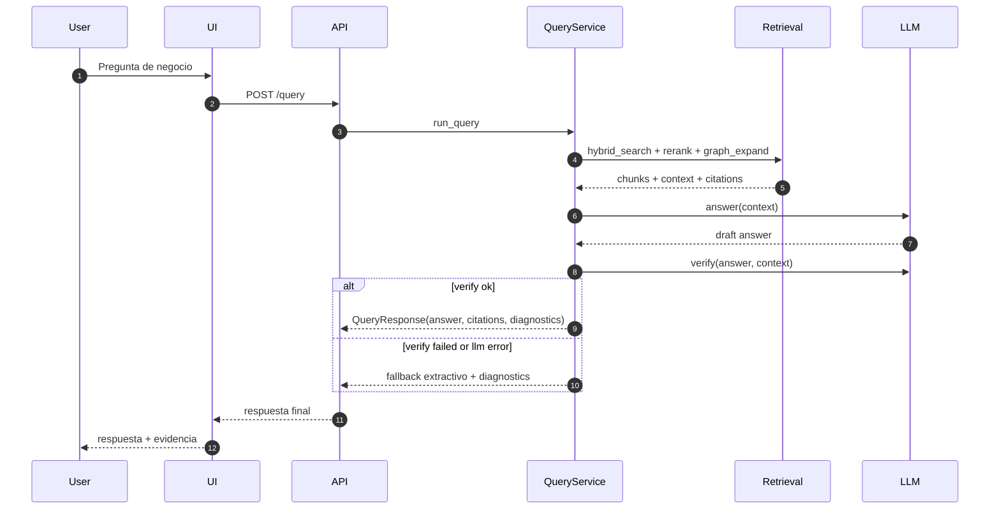
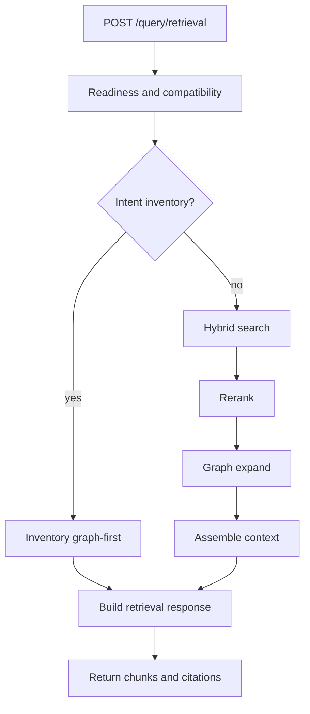
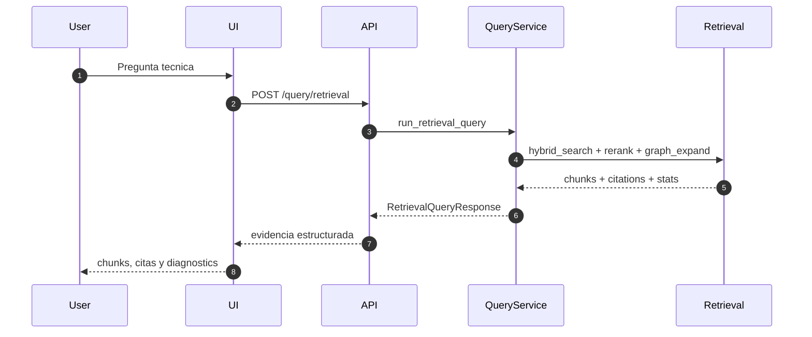

# Architecture and Customer Journeys

Documento de referencia para entender la interaccion entre usuario, UI,
API, pipeline de ingesta, retrieval y LLM.

## Vista ejecutiva de journeys

## Journey 1: Ingesta

### Flujo

### Secuencia

## Journey 2: Query con LLM

### Flujo

### Secuencia

## Journey 3: Query retrieval-only

### Flujo

### Secuencia

## Componentes principales

- UI PySide6: captura inputs de ingesta/consulta y presenta evidencias.
- API FastAPI: valida precondiciones y expone contratos HTTP.
- JobManager: orquesta estados de ingesta y persistencia de logs.
- Retrieval pipeline: fusion vectorial + BM25 + expansion de grafo.
- LLM clients: answer y verify en proveedores soportados.
- Storage: Chroma, BM25, Neo4j, SQLite metadata y workspace local.

## Referencias

- Endpoints y contratos: docs/API_REFERENCE.md
- Instalacion: docs/INSTALLATION.md
- Configuracion: docs/CONFIGURATION.md
- Troubleshooting: docs/TROUBLESHOOTING.md
