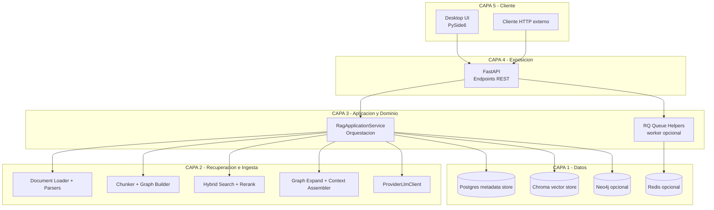
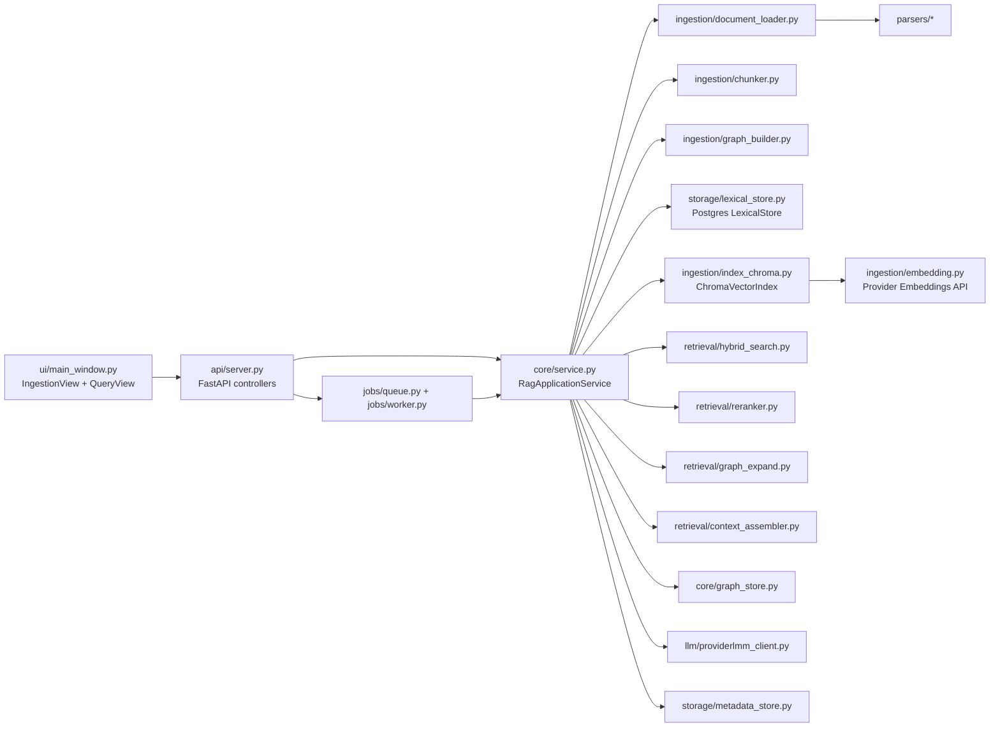
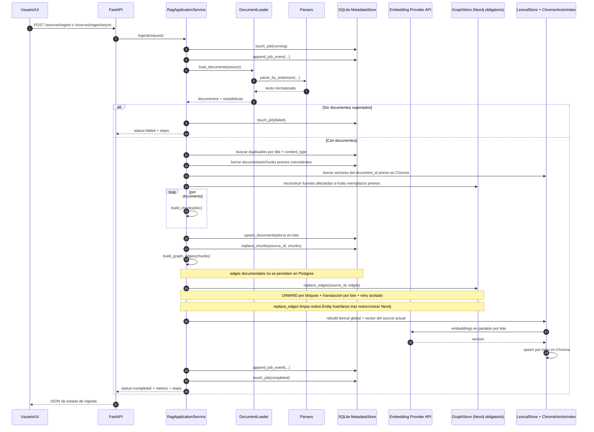
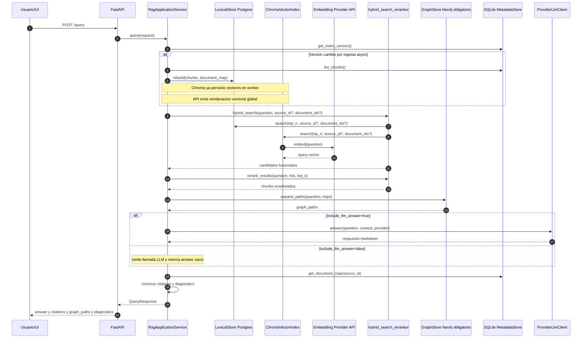

# Arquitectura Tecnica

## Estado Del Cutover

Este documento mezcla la arquitectura actual con el contrato objetivo aprobado para el cutover.
Mientras la implementación siga migrando, las referencias a SQLite, BM25 operativo, Chroma embebido
o staging persistente deben leerse como estado actual o legacy, no como contrato final.

El runtime objetivo aprobado es:

- Postgres para metadata operacional y soporte de retrieval léxico.
- Chroma remoto para persistencia y búsqueda vectorial.
- Neo4j para grafo y TDM.

Las decisiones de alcance y storage que gobiernan la implementación están consolidadas en
[DESIGN_DECISIONS.md](DESIGN_DECISIONS.md).

## Resena de arquitectura

RAG Hybrid Response Validator implementa una arquitectura modular orientada a
servicios para resolver dos capacidades principales:

- Ingesta de conocimiento documental (carpeta local o Confluence) hacia
  estructuras consultables.
- Consulta con RAG hibrido (vector + lexical + grafo) con trazabilidad de
  evidencia.

El sistema esta disenado para operar con ChromaDB activo en runtime para la
capa vectorial y Neo4j opcional para capa de grafo. Componentes opcionales
adicionales de produccion:

- Redis + RQ para ingesta asincrona.
- Proveedores de embedding/answer externos (OpenAI, Gemini, Vertex AI).

## Descripcion general

Antes del cutover completo, esta seccion sigue describiendo componentes actuales. El target final aprobado
retira SQLite y Chroma embebido del contrato operativo y elimina la dependencia de workspace persistente.

### Runtime principal

- UI de escritorio en PySide6 (`src/coderag/ui/*`) para operar ingesta y consulta.
- Capa UI con tema centralizado, validaciones en cliente y estados visuales de
  operacion (progreso, resumen y diagnostico tecnico desacoplado).
- API FastAPI (`src/coderag/api/server.py`) como fachada de operaciones.
- Orquestador de negocio (`src/coderag/core/service.py`) con flujo end-to-end.
- Persistencia SQLite (`src/coderag/storage/metadata_store.py`) para documentos,
  chunks, aristas, jobs, eventos de timeline por job (`job_events`) y estado
  de runtime (`runtime_state`).
- Persistencia vectorial en Chroma (`src/coderag/ingestion/index_chroma.py`) para
  embeddings de chunks y busqueda de similitud.
- Retrieval hibrido (`src/coderag/retrieval/*`) con ranking y expansion por grafo.
- Integracion de LLM (`src/coderag/llm/providerlmm_client.py`) para respuesta.

### Principios de diseno actuales

- Chroma-first: la capa vectorial requiere Chroma (`USE_CHROMA=true`).
- Neo4j opcional: la capa de grafo se habilita con `USE_NEO4J=true`; con
  `USE_NEO4J=false` el core sigue operativo sin expansion por grafo.
- Evolutivo: interfaces internas permiten reemplazar componentes por equivalentes
  gestionados sin romper contratos API/UI.
- Explicable: cada respuesta expone evidencias (`citations`) y rutas de grafo
  (`graph_paths`) con diagnosticos de pipeline.
- Observable: la ingesta persiste eventos con progreso y tiempos acumulados,
  reutilizados por UI/API para seguimiento en vivo.
- Performante por lotes: documentos, Chroma y Neo4j se procesan con estrategias
  de batching para reducir latencia total en ingestas medianas/grandes.
- Consistencia cross-process: en modo async con RQ, la API detecta cambios
  de `index_version` en SQLite y refresca indices en query sin reinicio.
- Composicion por contratos: el runtime tipa store y artifact store con
  protocolos explicitos (`core/protocols.py`) para desacoplar casos de uso de
  implementaciones concretas.
- Inicializacion centralizada: las dependencias de `RagApplicationService`
  se construyen via `core/composition.py`, permitiendo inyeccion en pruebas
  y reduciendo acoplamiento en el constructor del servicio.
- Extraccion incremental de casos de uso: la fachada
  `RagApplicationService` delega operaciones de ciclo de ingesta y estado de
  jobs a `core/ingestion_service.py` y `core/job_service.py`, manteniendo
  compatibilidad de contrato mientras avanza el desacople del monolito.
  En este corte, la deduplicacion previa y la materializacion de
  documentos/chunks/grafo para ingesta ya viven en metodos atomicos dentro de
  `IngestionApplicationService`.
  La construccion de chunks con snapshots de progreso tambien se ejecuta en
  ese subservicio, mientras la fachada conserva solo la traduccion de eventos
  hacia el timeline publico del job.
  El rebuild post-ingesta de indices (lexico global + vector por source)
  tambien se encapsula en ese subservicio para mantener la fachada enfocada
  en orquestacion.
  El armado del payload final de resultado y metricas de ingesta completada
  tambien queda centralizado en ese subservicio.
  La persistencia de pasos del timeline (`job_events`), actualizacion de
  estado incremental del job y callback de progreso tambien se encapsulan en
  ese subservicio para reducir acoplamiento en la fachada.
  La construccion de mensajes de fallo por fuente vacia/no valida y el payload
  final de respuesta `failed` de ingesta tambien se centralizan en ese
  subservicio.
  El mapeo de progreso del loader de documentos (banda de avance temprana)
  tambien se encapsula en ese subservicio para mantener consistente la
  telemetria de steps.
- La consulta RAG hibrida tambien inicia su separacion en
  `core/query_service.py`; la fachada conserva el refresh de indices y delega
  la ejecucion de retrieval, expansion de grafo y grounding en ese servicio.
- El bloque TDM de consulta/catalogo tambien inicia su separacion en
  `core/tdm_query_service.py`; la fachada delega `query_tdm`, catalogos por
  servicio/tabla y previews de virtualizacion/sinteticos manteniendo contratos.
- La ingesta TDM tambien inicia su separacion en
  `core/tdm_ingestion_service.py`; la fachada delega `ingest_tdm_assets(...)`
  para mantener aislada la recomputacion de edges tipados y el update de
  metricas de grafo TDM.
- Los guardrails de habilitacion TDM (feature flag + requisito de grafo)
  tambien se centralizan en `core/tdm_policy_service.py` para evitar logica
  de validacion duplicada en la fachada y en subservicios TDM.
- La coordinacion de versionado y refresh de indices de retrieval tambien se
  encapsula en `core/index_coordinator_service.py`, dejando la fachada con
  estado minimo (`_loaded_index_version`) y delegacion explicita.
- La capa UI tambien inicia desacople por responsabilidades: transporte HTTP
  en `ui/api_client.py` y logica de validacion/normalizacion en presenters
  (`ui/ingestion_presenter.py`, `ui/query_presenter.py`,
  `ui/tdm_presenter.py`) y controlador de catalogo
  (`ui/document_catalog_controller.py`).

## Checklist De Cierre Fase 2.3

La siguiente matriz consolida trazabilidad verificable entre contratos publicos
de la fachada, servicios extraidos y suites que protegen compatibilidad.

| Estado | Metodo publico en fachada (`core/service.py`) | Servicio extraido | Cobertura unitaria directa | Cobertura de regresion/contrato |
| --- | --- | --- | --- | --- |
| Completado | `query(request)` | `QueryApplicationService.query(...)` | `tests/test_query_application_service.py` | `tests/test_query_view.py` |
| Completado | `rebuild_indexes(...)` + refresh previo a `query(...)` | `RetrievalIndexCoordinator` | `tests/test_index_coordinator_service.py` | `tests/test_pipeline.py` |
| Completado | `query_tdm(request)` | `TdmQueryApplicationService.query_tdm(...)` | `tests/test_tdm_query_application_service.py` | `tests/test_tdm_view.py`, `tests/test_tdm_api_routes.py`, `tests/test_tdm_compat_contract.py` |
| Completado | `ingest_tdm_assets(request)` | `TdmIngestionApplicationService.ingest_tdm_assets(...)` | `tests/test_tdm_ingestion_application_service.py` | `tests/test_tdm_ingestion_pipeline.py`, `tests/test_tdm_api_routes.py` |
| Completado | Guardrails `is_tdm_graph_enabled` / `ensure_*` | `TdmPolicyService` | `tests/test_tdm_policy_service.py` | `tests/test_tdm_api_routes.py`, `tests/test_tdm_service_planning.py` |
| Completado | `get_tdm_service_catalog(...)` | `TdmQueryApplicationService.get_tdm_service_catalog(...)` | `tests/test_tdm_query_application_service.py` | `tests/test_tdm_view.py` |
| Completado | `get_tdm_table_catalog(...)` | `TdmQueryApplicationService.get_tdm_table_catalog(...)` | `tests/test_tdm_query_application_service.py` | `tests/test_tdm_view.py` |
| Completado | `preview_tdm_virtualization(...)` | `TdmQueryApplicationService.preview_tdm_virtualization(...)` | `tests/test_tdm_query_application_service.py` | `tests/test_tdm_api_routes.py`, `tests/test_tdm_view.py` |
| Completado | `get_tdm_synthetic_profile(...)` | `TdmQueryApplicationService.get_tdm_synthetic_profile(...)` | `tests/test_tdm_query_application_service.py` | `tests/test_tdm_service_planning.py`, `tests/test_tdm_view.py` |

### Criterios De Aceptacion De Cierre Fase 5

- Las suites unitarias directas de `QueryApplicationService` y
  `TdmQueryApplicationService` pasan en verde.
- Las rutas API y vistas TDM/Query mantienen payloads y semantica sin
  cambios contractuales observables.
- Las pruebas de compatibilidad de modelos y contrato TDM se ejecutan en
  verde antes de avanzar al siguiente corte de descomposicion.
- Los guardrails TDM y el refresh por `index_version` quedan cubiertos por
  pruebas unitarias directas de servicios extraidos.

## Checklist De Cierre Fase 3 (UI)

| Estado | Componente UI | Responsabilidad extraida | Cobertura |
| --- | --- | --- | --- |
| Completado | `ui/main_window.py` | Transporte HTTP delegado en `ui/api_client.py` | `tests/test_main_window_ingestion_mode.py`, `tests/test_ui_api_client.py` |
| Completado | `ui/ingestion_view.py` | Validacion + payload + formateo en presenter/formatters | `tests/test_ingestion_view.py`, `tests/test_ingestion_presenter.py` |
| Completado | `ui/query_view.py` | Validacion/payload y control de catalogo desacoplados | `tests/test_query_view.py`, `tests/test_query_presenter.py` |
| Completado | `ui/tdm_view.py` | Payload builders y normalizacion de resultados en presenter | `tests/test_tdm_view.py`, `tests/test_tdm_presenter.py` |

## Checklist De Cierre Fase 5 (Contratos y Regresion)

| Estado | Objetivo | Cobertura principal |
| --- | --- | --- |
| Completado | Wiring por composicion en `core/composition.py` | `tests/test_composition.py` |
| Completado | Seleccion de runtime store segun `POSTGRES_*` | `tests/test_runtime_store_selection.py` |
| Completado | Ruteo del store hibrido (Postgres + fallback legacy) | `tests/test_hybrid_metadata_store.py` |
| Completado | Delegacion UI shell -> cliente/presenters | `tests/test_ui_api_client.py`, `tests/test_ingestion_presenter.py`, `tests/test_query_presenter.py`, `tests/test_tdm_presenter.py`, `tests/test_main_window_ingestion_mode.py` |

### Criterios De Aceptacion De Cierre

- Los contratos de composicion y runtime deben tener pruebas especificas y
  aisladas de la vista UI.
- El fallback legacy a SQLite no debe activarse cuando exista DSN Postgres;
  cualquier acceso no migrado debe fallar de forma explicita.
- La UI debe mantener el patron shell + transporte + presenter/controlador,
  evitando reintroducir logica de dominio en widgets Qt.

## Diagrama de infraestructura por capas

```mermaid
flowchart TB
    subgraph L5[CAPA 5 - Cliente]
        UI[Desktop UI\nPySide6]
        APIClient[Cliente HTTP externo]
    end

    subgraph L4[CAPA 4 - Exposicion]
        FastAPI[FastAPI\nEndpoints REST]
    end

    subgraph L3[CAPA 3 - Aplicacion y Dominio]
        Service[RagApplicationService\nOrquestacion]
        Jobs[RQ Queue Helpers\nworker opcional]
    end

    subgraph L2[CAPA 2 - Recuperacion e Ingesta]
        Loader[Document Loader + Parsers]
        Chunker[Chunker + Graph Builder]
        Retrieval[Hybrid Search + Rerank]
        GraphExpand[Graph Expand + Context Assembler]
        LLM[ProviderLlmClient]
    end

    subgraph L1[CAPA 1 - Datos]
        Postgres[(Postgres metadata store)]
      Chroma[(Chroma vector store)]
        Neo4j[(Neo4j opcional)]
        Redis[(Redis opcional)]
    end

    UI --> FastAPI
    APIClient --> FastAPI
    FastAPI --> Service
    Service --> Loader
    Service --> Chunker
    Service --> Retrieval
    Service --> GraphExpand
    Service --> LLM
    Service --> Postgres
    Service --> Chroma
    Service --> Neo4j
    Jobs --> Redis
    FastAPI --> Jobs
```

### Notas de capas

- Capa 5 (Cliente): UI de operacion y clientes de integracion via HTTP.
- Capa 4 (Exposicion): contratos estables de API (`/sources/*`, `/query*`).
- Capa 3 (Aplicacion y Dominio): coordina casos de uso y politicas del flujo.
- Capa 2 (Recuperacion e Ingesta): contiene logica de parseo, chunking,
  indexacion, retrieval y grounding para respuesta.
- Capa 1 (Datos): Postgres obligatorio para metadata/runtime y servicios
  externos opcionales para capacidades vectoriales, grafo y cola.

## Diagrama de componentes

```mermaid
graph LR
    UI[ui/main_window.py\nIngestionView + QueryView]
    API[api/server.py\nFastAPI controllers]
    Service[core/service.py\nRagApplicationService]

    Loader[ingestion/document_loader.py]
    Parsers[parsers/*]
    Chunker[ingestion/chunker.py]
    GraphBuilder[ingestion/graph_builder.py]
    Lexical[storage/lexical_store.py\nPostgres LexicalStore]
    Vector[ingestion/index_chroma.py\nChromaVectorIndex]
    Embedding[ingestion/embedding.py\nProvider Embeddings API]

    Retrieval[retrieval/hybrid_search.py]
    Reranker[retrieval/reranker.py]
    GraphLocal[retrieval/graph_expand.py]
    Context[retrieval/context_assembler.py]

    GraphStore[core/graph_store.py]
    LLM[llm/providerlmm_client.py]
    Store[storage/metadata_store.py]

    RQ[jobs/queue.py + jobs/worker.py]

    UI --> API
    API --> Service

    Service --> Loader
    Loader --> Parsers
    Service --> Chunker
    Service --> GraphBuilder
    Service --> Store

    Service --> Lexical
    Service --> Vector
    Vector --> Embedding
    Service --> Retrieval
    Service --> Reranker

    Service --> GraphStore
    Service --> GraphLocal
    Service --> Context
    Service --> LLM

    API --> RQ
    RQ --> Service
```

## Secuencia principal: ingesta

```mermaid
sequenceDiagram
    autonumber
    participant User as Usuario/UI
    participant API as FastAPI
    participant SVC as RagApplicationService
    participant DL as DocumentLoader
    participant PRS as Parsers
    participant DB as SQLite MetadataStore
    participant EMB as Embedding Provider API
    participant GS as GraphStore (Neo4j obligatorio)
    participant IDX as LexicalStore + ChromaVectorIndex

    User->>API: POST /sources/ingest o /sources/ingest/async
    API->>SVC: ingest(request)
    SVC->>DB: touch_job(running)
    SVC->>DB: append_job_event(...)

    SVC->>DL: load_documents(source)
    DL->>PRS: parse_by_extension(...)
    PRS-->>DL: texto normalizado
    DL-->>SVC: documentos + estadisticas

    alt Sin documentos soportados
        SVC->>DB: touch_job(failed)
        SVC-->>API: status=failed + steps
    else Con documentos
      SVC->>DB: buscar duplicados por title + content_type
      SVC->>DB: borrar documentos/chunks previos coincidentes
      SVC->>IDX: borrar vectores del document_id previo en Chroma
      SVC->>GS: reconstruir fuentes afectadas si hubo reemplazos previos
        loop por documento
            SVC->>SVC: build_chunks(doc)
        end
        SVC->>DB: upsert_documents(docs) en lote
        SVC->>DB: replace_chunks(source_id, chunks)
        SVC->>SVC: build_graph_edges(chunks)
        Note over SVC,DB: edges documentales no se persisten en Postgres
        SVC->>GS: replace_edges(source_id, edges)
        Note over SVC,GS: UNWIND por bloques + transaccion por lote + retry acotado
        Note over SVC,GS: replace_edges limpia nodos Entity huerfanos tras resincronizar Neo4j
        SVC->>IDX: rebuild lexical global + vector del source actual
        IDX->>EMB: embeddings en paralelo por lote
        EMB-->>IDX: vectors
        IDX->>IDX: upsert por lotes en Chroma
        SVC->>DB: append_job_event(...)
        SVC->>DB: touch_job(completed)
        SVC-->>API: status=completed + metrics + steps
    end

    API-->>User: JSON de estado de ingesta
```

  La deduplicacion previa es global: si un documento nuevo coincide por
  `title + content_type` con uno ya persistido, la version previa se elimina de
  SQLite, Chroma y del mirror local de staging antes de indexar la nueva.
  Cuando el documento reemplazado pertenecia a otra fuente, el grafo gestionado se
  reconstruye para ese `source_id` afectado y Neo4j elimina nodos `Entity`
  huerfanos al finalizar la resincronizacion.

## Secuencia principal: consulta

```mermaid
sequenceDiagram
    autonumber
    participant User as Usuario/UI
    participant API as FastAPI
    participant SVC as RagApplicationService
    participant LEX as LexicalStore Postgres
    participant VEC as ChromaVectorIndex
    participant EMB as Embedding Provider API
    participant RET as hybrid_search_reranker
    participant GS as GraphStore Neo4j obligatorio
    participant DB as SQLite MetadataStore
    participant LLM as ProviderLlmClient

    User->>API: POST /query
    API->>SVC: query(request)
    SVC->>DB: get_index_version()
    alt Version cambio por ingesta async
        SVC->>DB: list_chunks()
      SVC->>LEX: rebuild(chunks, document_map)
        Note over SVC,VEC: Chroma ya persistio vectores en worker
        Note over SVC,VEC: API evita reindexacion vectorial global
    end

    SVC->>RET: hybrid_search(question, source_id?, document_ids?)
    RET->>LEX: search(top_n, source_id?, document_ids?)
    RET->>VEC: search(top_n, source_id?, document_ids?)
    VEC->>EMB: embed(question)
    EMB-->>VEC: query vector
    RET-->>SVC: candidatos fusionados

    SVC->>RET: rerank_results(question, hits, top_k)
    RET-->>SVC: chunks rerankeados

    SVC->>GS: expand_paths(question, hops)
    GS-->>SVC: graph_paths

    alt include_llm_answer=true
      SVC->>LLM: answer(question, context, provider)
      LLM-->>SVC: respuesta markdown
    else include_llm_answer=false
      Note over SVC: omite llamada LLM y retorna answer vacio
    end

    SVC->>DB: get_document_map(source_id)
    SVC->>SVC: construir citations y diagnostics
    SVC-->>API: QueryResponse
    API-->>User: answer y citations y graph_paths y diagnostics
```

Notas del filtro de Query:

- `source_id` mantiene semantica de fuente/lote de ingesta.
- `document_ids` permite acotar retrieval a uno o mas documentos ya
  persistidos en SQLite.
- La UI obtiene el catalogo de documentos via `GET /sources/documents` y envia
  `document_ids` solo cuando el usuario selecciona archivos concretos.

## Consideraciones de despliegue

- Modo local (default): API + UI + Postgres + Chroma remoto + Neo4j opcional.
- Modo expandido: activar `USE_RQ=true` para procesamiento asincrono.
- Docker Compose incluye servicios `redis` y `neo4j`; la capa vectorial usa
  Chroma remoto por HTTP (`CHROMA_HOST`/`CHROMA_PORT`).

## Consistencia post-ingesta async

- El worker de ingesta (RQ) persiste chunks en SQLite y vectores en Chroma,
  luego incrementa `index_version` en `runtime_state`.
- La API mantiene un `loaded_index_version` en memoria por proceso.
- En el siguiente `/query`, si detecta mismatch de version:
  - reconstruye el corpus lexico desde chunks persistidos,
  - reutiliza vectores ya persistidos en Chroma,
  - actualiza su version cargada y continua el retrieval.
- Este enfoque evita reinicio manual de API y reduce el riesgo de timeout en
  la primera consulta posterior a ingesta async.

## Optimizaciones recientes de ingesta

- Persistencia de documentos en SQLite en lote (`upsert_documents`) para
  reducir commits por documento.
- Persistencia de relaciones en Neo4j con UNWIND por bloques configurables,
  transaccion por lote y reintentos acotados para fallas transitorias.
- Generacion de embeddings de chunks con concurrencia configurable y escritura
  a Chroma por lotes para mejorar throughput.
- Timeline de ingesta persistido en `job_events` con progreso (`progress_pct`)
  y `elapsed_hhmmss` acumulado para visualizacion en UI y polling de jobs.

Parametros de tuning relevantes:

- `INGEST_EMBED_WORKERS`
- `CHROMA_UPSERT_BATCH_SIZE`
- `NEO4J_INGEST_BATCH_SIZE`
- `NEO4J_INGEST_MAX_RETRIES`
- `NEO4J_INGEST_RETRY_DELAY_MS`

## Extension TDM (iteracion aditiva)

La iteracion actual incorpora una base TDM sin romper contratos existentes:

- Nuevos modelos de dominio TDM en `src/coderag/core/models.py`
  (`TdmSchemaAsset`, `TdmTableAsset`, `TdmColumnAsset`,
  `TdmServiceMapping`, `TdmMaskingRule`, `TdmSyntheticProfile`,
  `TdmVirtualizationArtifact`).
- Nuevas tablas SQLite aditivas para catalogo TDM en
  `src/coderag/storage/metadata_store.py`:
  `tdm_schemas`, `tdm_tables`, `tdm_columns`, `tdm_service_mappings`,
  `tdm_masking_rules`, `tdm_virtualization_artifacts`,
  `tdm_synthetic_profiles`.
- Parsers TDM especializados en `src/coderag/parsers/*` para:
  - SQL DDL (`sql_schema_parser.py`),
  - contratos OpenAPI (`openapi_service_parser.py`),
  - diccionarios de datos y pistas de masking (`data_dictionary_parser.py`).
- Orquestador dedicado de ingesta TDM en
  `src/coderag/ingestion/tdm_ingestion.py`.
- Builder de grafo tipado TDM en `src/coderag/ingestion/tdm_graph_builder.py`
  y persistencia en Neo4j via `GraphStore.replace_tdm_edges`.
- Modulos de dominio TDM para etapa avanzada:
  - `src/coderag/tdm/masking_engine.py`
  - `src/coderag/tdm/synthetic_planner.py`
  - `src/coderag/tdm/virtualization_export.py`
- Endpoints TDM nuevos (`/tdm/*`) en `src/coderag/api/server.py`,
  habilitados por `ENABLE_TDM=true`.

Compatibilidad:

- Rutas actuales (`/sources/*`, `/query*`) se mantienen sin cambios.
- Activacion controlada por flags (`ENABLE_TDM` y derivados) con default
  `false` para preservar funcionalidad existente.
- Las rutas legacy (`/sources/*`, `/query*`) no dependen de TDM y mantienen
  contrato y payload sin cambios.
